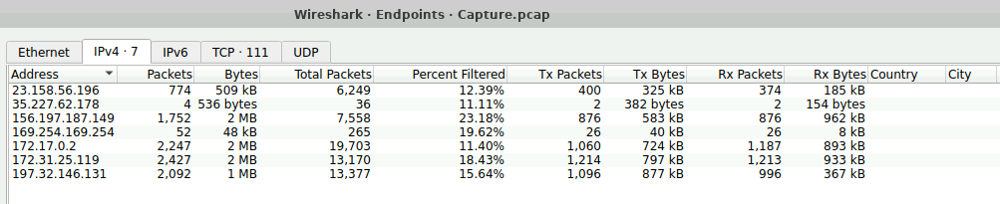

# Lab: Jetbrains

**Tactics:** Initial Access, Execution, Command and Control  
**Tools:** Wireshark
 
---

## Analyze network traffic using Wireshark to identify web server exploitation, extract attacker IOCs and persistence mechanisms, and map attack techniques to MITRE ATT&CK.

### Snario:
During a recent security incident, an attacker successfully exploited a vulnerability in our web server, allowing them to upload webshells and gain full control over the system. The attacker utilized the compromised web server as a launch point for further malicious activities, including data manipulation. 

As part of the investigation, You are provided with a packet capture (PCAP) of the network traffic during the attack to piece together the attack timeline and identify the methods used by the attacker. The goal is to determine the initial entry point, the attacker's tools and techniques, and the compromise's extent.

---

### Q1: What is the attacker's IP address?

I opened the PCAP file using Wireshark and saw a long list of packets captured during the incident. 

  

First I applied the http filter to sort http requests only. As web request to server are in http, filtering will give us the packets we need to analyze for the behavior. 

  

Discovered that, in the `Statistics -> Endpoints` tab in Wireshark we can easily list all endpoints on the http requests. Endpoints are the devices that are have been involved during the packet capturing. Here is a list of all endpoints found. It gives all unique IPs that sent the request to server. One of these is our desired IP, which is attackers endpoints.

  

As our payload was uploaded to the site, to find the requests in http which used upload we want to list those specific http requests. I used an advance search filter `http and http contains "upload"`, which resulted in only the IP address which was using an upload request. 

  

`So our desired IP is: ***23.158.56.196***`

Further to see all the request captured in the packets, I discovered that we can create a follow of all the packets of any desired IP. 

`Right Click -> Follow -> Http Stream.`

It join the contents the packets of an IP into a proper request and response form. This request and response in http can be analyzed for further analysis of each request.

  

### Q2. To identify potential vulnerability exploitation, what version of our web server service is running?

Okay so find what server is running, i simply looked at the http stream of the packets. In the first line of the response http request the version number of the server was mentioned.

`Server is running the service: ***2023.11.3*** under the tag, server service.`  
`The Build number is 147512.`  
We can see more detials as well.

  

### Q3. After identifying the version of our web server service, what CVE number corresponds to the vulnerability the attacker exploited?

To find the CVE (common vulnerability and exposure) number of this request first it is important to know what the attack was exactly. For this purpose i opened the HTTP stream. Tried to read the requests i found that there is a privilege escalation made, the user role is assigned to admin bypassing the authentication system.

Secondly there is a upload made. It is a zip file. In this file is a malicious java script, the payload is running some shell/cmd command.  
`Payload Type: Zip file`  
`Named: NSt8bHTg.zip`

  

Now that we the attack is known and server service running in it `(2023.11.3)`, which will be used to identify the CVE number. I visited the [CVE website](https://www.cve.org/), and entered the server service number. I found that the CVE that matched the description and service number is `CVE-2024-23917`. But this CVE number was not the answer of the question.

  

After analyzing the walkthrough, i realized that in this case, the vulnerability was resolved in TeamCity version `2023.11.4`, as noted on the JetBrains site. So i retried the search with `Service Service: 2023.11.4`. Which showed another matching CVE number.

  

`Hence required CVE number is: CVE-2024-27198.`

### 4. The attacker exploited the vulnerability to create a user account. What credentials did he set up?

There is a request in http stream where attacker used these credentials to setup an account.  
`Username: c91oyemw` 
`Password: CL5vzdwLuK` 
`Email: c91oyemw@example.com` 
`Role: SYSTEM_ADMIN`

  

### Q5. The attacker uploaded a web shell to ensure his access to the system. What is the name of the file that the attacker uploaded?

After analyzing the Stream, observed that attacker uploaded a zip file. In this file is a malicious java script, the payload is running some shell/cmd command.  

`Payload File Type: zip  
File Named: NSt8bHTg.zip`

### Q6. When did the attacker execute their first command via the web shell?

Looking at the stream, there was some activity after the file upload. 

Attacker activated the plugin, using the   command `enabled=true&action=setEnabled&uuid=a727133c-6b63-4a06-bb9a-1d564728a1d9`

  

Then he used `cmd=ls` to list all the directories and files in the system which he took the access of. 

The timestamps of the response of command was: `2024-06-30 08:03`

### Q7. The attacker tampered with a text file that contained the credentials of the admin user of the webserver. What new username and password did the attacker write in the file?

I looked into the stream there was not such command in this stream. So i searched with another filter `http and http contains "cmd"` so that we get all the packets that contain the keyword cmd. As the command was running in the command line.

  

So i looked into the each, command and found the cmd command in a http request where username and password were passed.

The command is: 

`cmd=bash+-c+%27echo+%22username%3Aa1l4m%2Cpassword%3Ayouarecompromised%22+%3E+%2Ftmp%2FCreds.txt%27]`

which is equal to: 

`bash -c 'echo "username:a1l4m,password:youarecompromised" > /tmp/Creds.txt`

  

The credentials used are:  
`Username: a1l4m` 
`Password: youarecompromised`

### Q8. What is the MITRE Technique ID for the attacker's action in the previous question (Q7) when tampering with the text file?

Based on the context of the attacker's file tampering activity, the relevant MITRE ATT&CK sub-technique under the Data Manipulation category is `T1565.001` - Data Manipulation: Stored Data.

This sub-technique involves an attacker modifying stored data, such as files containing credentials, to achieve their objectives. In the context of the attacker modifying the `/tmp/creds.txt` file to insert new credentials `(username: a1l4m, password: youarecompromised)`, the action directly aligns with `T1565.001`, as it manipulates stored data to grant unauthorized access and maintain persistence.

### Q9. The attacker tried to escape from the container but he didn’t succeed, What is the command that he used for that?

Analysis of the executed commands reveals that the attacker attempted to escape the containerized environment by exploiting Docker's capabilities. The specific command executed is:

`cmd=docker run --rm -it --privileged ubuntu`

This command attempts to start a new Docker container with the `--privileged` flag, which would grant the container elevated privileges, effectively giving it access to the host system’s resources. The attacker uses the ubuntu image to launch the container interactively `(-it)` and remove it `(--rm)` after it exits. The intent behind this command is to leverage the --privileged mode to bypass container isolation and gain access to the underlying host.

However, ***the attack was unsuccessful***, possibly due to restrictions on privileged Docker operations or insufficient permissions to execute this command on the host. The attacker’s other commands, along with the one previously discussed, represent different approaches to container escape. Here's an explanation of each:

`cmd=docker run --rm -it -v /:/host ubuntu chroot /host`

This command tries to mount the entire root filesystem `(/)` of the host into the container at the `/host` directory using the `-v /:/host` option. The attacker then uses the `chroot`q command to change the root directory of the container’s shell environment to /host, effectively allowing them to operate in the context of the host’s file system. If successful, this would enable the attacker to directly interact with the host’s files and potentially manipulate critical system components. This method is commonly used in container escape attempts when direct host filesystem access is required.

`cmd=docker run -v /var/run/docker.sock:/var/run/docker.sock -it ubuntu`

This command mounts the Docker socket `(/var/run/docker.sock)` from the host into the container. The Docker socket is a UNIX domain socket used to communicate with the Docker daemon. By accessing it, the attacker could potentially control the Docker daemon directly from within the container. This control would allow them to start new containers, execute commands, or even gain access to the host by running containers with elevated privileges. This approach is a known and effective method for container breakout if proper access controls on the Docker socket are not enforced.

#CyberDefenders #CyberSecurity #BlueYard #BlueTeam #InfoSec #SOC #SOCAnalyst #DFIR #CCD #CyberDefender
